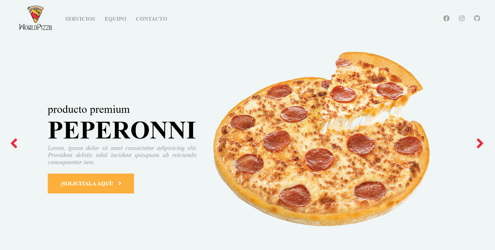

# World Pizza
Sitio web de restaurante — HTML5, CSS3 y JavaScript

## Descripción General
World Pizza es una página web estática, moderna y completamente responsive desarrollada con HTML5, CSS3 y JavaScript puro, creada como parte de un curso de desarrollo web desde cero.

El proyecto simula el sitio web de un restaurante de pizzas y comida rápida, incorporando animaciones, interacciones dinámicas y efectos visuales profesionales sin el uso de frameworks.

El objetivo principal es aplicar y reforzar conceptos fundamentales del desarrollo web frontend, mostrando cómo construir una web atractiva, funcional y adaptable a dispositivos móviles.

Incluye secciones informativas, animaciones con JavaScript, validaciones de formularios, navegación suave y diseño responsive.

Incluye:
- Página web estática profesional
- Navegación con scroll suave
- Menú interactivo con efectos hover
- Sección de productos (pizzas)
- Sección “Nosotros”
- Sección de equipo / staff
- Sección de ingredientes
- Formulario de contacto con validación
- Botón flotante para volver al inicio
- Animaciones y efectos con JavaScript
- Diseño totalmente responsive
- Menú móvil para dispositivos pequeños

## Características Principales

- Navegación con anclas y desplazamiento suave
- Efectos hover en menú, imágenes y tarjetas
- Cambio dinámico de contenido con JavaScript
- Botón “Ir arriba” visible al hacer scroll
- Validación de formulario de contacto
- Alertas dinámicas (campos vacíos / envío exitoso)
- Imágenes en blanco y negro con transición a color
- Iconos con Font Awesome
- Diseño adaptable a desktop, tablet y móvil
- Transiciones suaves y animaciones personalizadas

## Tecnologías Utilizadas
### Frontend

- HTML5
- CSS3
- JavaScript (Vanilla JS)
- Flexbox
- Diseño Responsive (Media Queries)

### Librerías y Recursos

- Font Awesome
- Imágenes optimizadas
- Iconos SVG y PNG

### Tooling

- Visual Studio Code
- Navegador Web (Chrome, Edge, Firefox)
- Git & GitHub

## Arquitectura del Proyecto

El proyecto sigue una estructura clara y ordenada para facilitar el aprendizaje y mantenimiento:

```bash
world-pizza
│── css/
│   └── estilos.css        → Estilos principales
│
│── js/
│   └── app.js             → Lógica e interactividad con JavaScript
│
│── img/
│   │── menu/              → Imágenes del menú de pizzas
│   │── ingredientes*.jpg  → Imágenes de ingredientes
│   │── perfil*.png        → Imágenes del equipo
│   │── logo.png
│   │── mitad-mitad.png
│
│── lib/
│   └── fontawesome/       → Librería de íconos
│
│── docs/
│   └── images/
│       └── pizza.png      → Recursos para documentación
│
│── index.html             → Página principal
```
### Secciones del Sitio Web
- Inicio
- Servicios / Menú
- Nosotros
- Equipo / Staff
- Ingredientes
- Contacto
- Footer con información y redes sociales

### Funcionalidades JavaScript
- Scroll animado entre secciones
- Botón flotante “Ir arriba” con transición suave
- Cambio dinámico de imágenes y contenido
- Validación de formulario de contacto
- Alertas personalizadas de error y éxito
- Menú desplegable para dispositivos móviles

## Requisitos Previos

No se requieren instalaciones especiales.
Solo necesitas:
- Un navegador web moderno
- Editor de código (recomendado: VS Code)

## Instalación y Uso
1. Clonar el repositorio

```bash
git clone https://github.com/sebastian-alpizar/world-pizza.git
```
2. Abrir el proyecto:
```bash
cd world-pizza
```
3. Ejecutar la aplicación:
- Abrir el archivo `index.html` en el navegador
- O usar Live Server desde VS Code

### Responsive Design
El sitio es 100% responsive, adaptándose correctamente a:

- Escritorio
- Tablets
- Smartphones

## Enfoque Educativo

Este proyecto forma parte de un curso de desarrollo web desde cero, donde se aplican conceptos como:

- Estructura HTML semántica
- Diseño con Flexbox
- Transiciones y animaciones CSS
- Manipulación del DOM con JavaScript
- Validación de formularios
- UX/UI básico
- Diseño responsive

Cada funcionalidad se construye paso a paso a lo largo del curso.

## Ejemplos Visuales


## Despliegue
Al ser un sitio estático, puede desplegarse fácilmente en:

- GitHub Pages
- Netlify
- Vercel
- Render
- Servidor Apache / Nginx

## Autor

**Desarrollado por Sebastián Alpízar Porras**  
GitHub: https://github.com/sebastian-alpizar  
Email: sebastianalpiz@gmail.com
